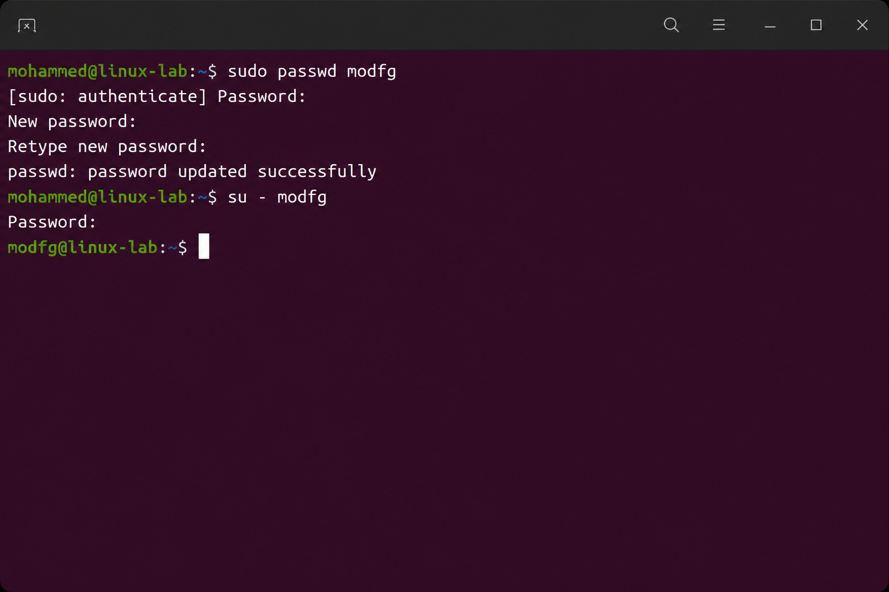
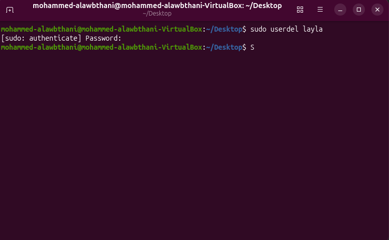

# Lesson 01 - User Management

## Creating a New Linux User

In this task, I created a new Linux user with a home directory.

### Command Used

```bash
sudo useradd -m alxndr
```

### Verification

I verified that the user was created successfully using:

```bash
id alxndr
```

### Result


---

## Setting a User Password

I set a password for the user `modfg` using the `passwd` command.

### Command Used

```bash
sudo passwd modfg
```

The message `password updated successfully` confirms that the password was updated successfully.

### Result



---

## Deleting a Linux User

I deleted the user `tayla` using the `userdel` command.

### Command Used

```bash
sudo userdel tayla
```

### Verification

I verified that the user was deleted using:

```bash
id tayla
```

If the account was deleted successfully, Linux displays:

```text
id: ‘tayla’: no such user
```

### Result


