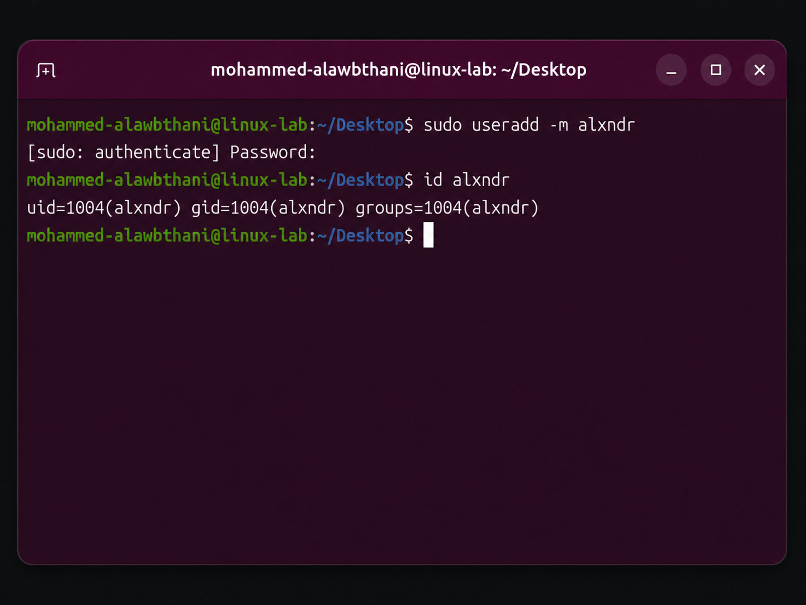
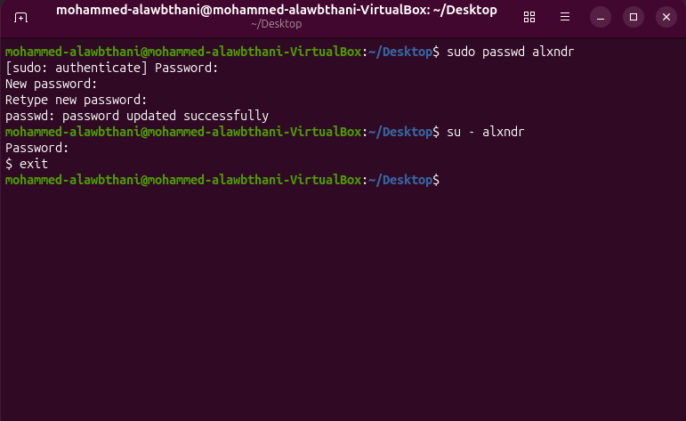
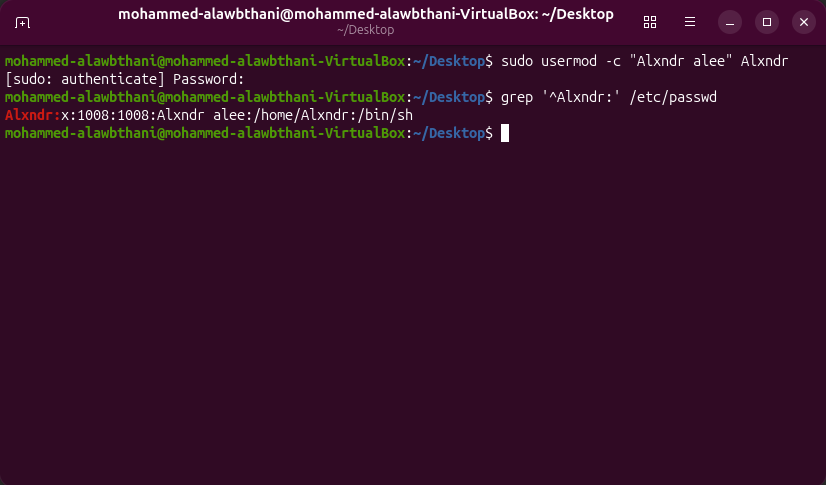
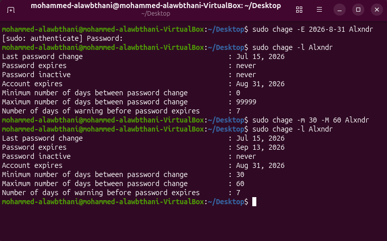
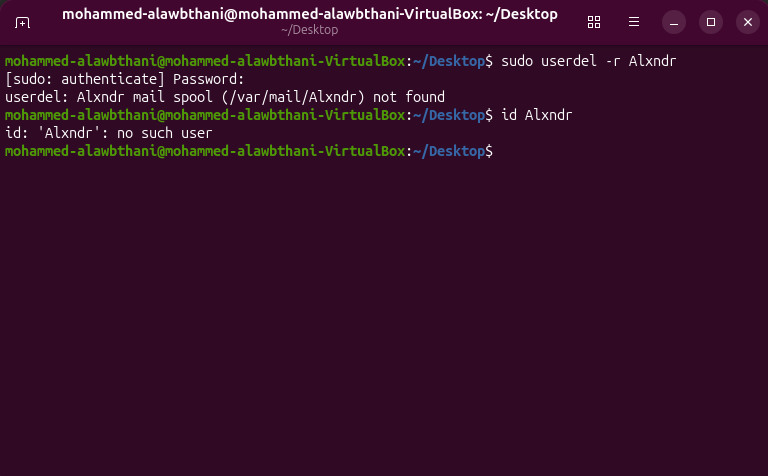

# Lesson 02 - Users and Groups

In this lesson, I practiced creating, modifying, securing, and deleting Linux user accounts.

---

## 1. Creating a New User

I created a new user named `Alxndr` and gave the account a home directory.

### Command

```bash
sudo useradd -m Alxndr
```

The `-m` option creates a home directory for the new user.

### Verification

```bash
id Alxndr
```

The output displayed the user's UID, GID, and group membership.

### Screenshot



---

## 2. Setting and Testing the User Password

I set a password for the user using the `passwd` command.

### Command

```bash
sudo passwd alxndr
```

The message below confirmed that the password was updated successfully:

```text
passwd: password updated successfully
```

I tested the password by switching to the user account:

```bash
su - alxndr
```

Then I returned to my original account using:

```bash
exit
```

### Screenshot



---

## 3. Modifying User Information

I modified the account information for the user `Alxndr`.

### Command

```bash
sudo usermod -c "Alxndr alee" Alxndr
```

The `-c` option changes the comment field, which can store the user's full name or description.

### Verification

```bash
grep '^Alxndr:' /etc/passwd
```

The output confirmed that the comment field was changed to:

```text
Alxndr alee
```

### Screenshot



---

## 4. Configuring Account and Password Expiration

I configured the account to expire on August 31, 2026.

### Account Expiration Command

```bash
sudo chage -E 2026-08-31 Alxndr
```

I also configured the password-aging policy.

### Password-Aging Command

```bash
sudo chage -m 30 -M 60 Alxndr
```

The password policy was configured as follows:

- Minimum password age: `30 days`
- Maximum password age: `60 days`
- Password warning period: `7 days`
- Account expiration date: `August 31, 2026`

### Verification

```bash
sudo chage -l Alxndr
```

### Screenshot



---

## 5. Deleting the User

I deleted the user `Alxndr` and removed the user's home directory.

### Command

```bash
sudo userdel -r Alxndr
```

Linux displayed this message:

```text
userdel: Alxndr mail spool (/var/mail/Alxndr) not found
```

This only means that the user did not have a mail spool file.

### Verification

```bash
id Alxndr
```

Linux displayed:

```text
id: ‘Alxndr’: no such user
```

This confirmed that the account was deleted successfully.

### Screenshot



---

## Commands Practiced

```bash
sudo useradd -m Alxndr
id Alxndr
sudo passwd alxndr
su - alxndr
exit
sudo usermod -c "Alxndr alee" Alxndr
grep '^Alxndr:' /etc/passwd
sudo chage -E 2026-08-31 Alxndr
sudo chage -m 30 -M 60 Alxndr
sudo chage -l Alxndr
sudo userdel -r Alxndr
id Alxndr
```

---

## What I Learned

- Creating a Linux user with a home directory.
- Verifying a user account using `id`.
- Setting and testing a user's password.
- Modifying user information using `usermod`.
- Configuring account expiration using `chage`.
- Configuring minimum and maximum password ages.
- Verifying password-aging settings.
- Deleting a user and confirming that the account no longer exists.
