# Project 2A - Linux User Management

In this project, I practiced basic Linux user management tasks, including creating users, setting passwords, verifying account information, locking and unlocking accounts, changing the user shell, modifying user information, configuring password aging, and deleting users.

---

## 1. Creating a New User

I created a new Linux user named `Alxndr`.

### Command

```bash
sudo useradd -m Alxndr
```

The `-m` option creates a home directory for the user.

### Verification

```bash
id Alxndr
```

### Screenshot

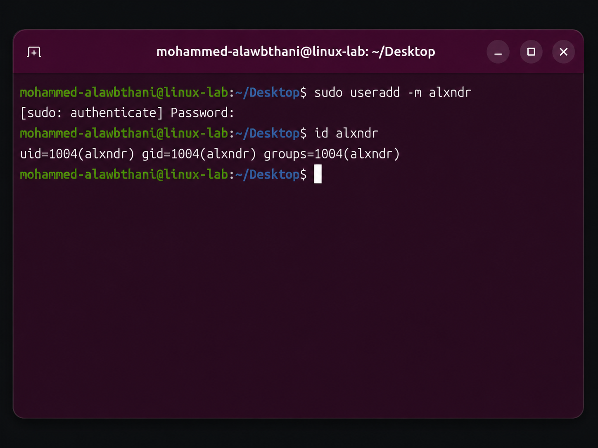

---

## 2. Setting a User Password

I set a password for the user using the `passwd` command.

### Command

```bash
sudo passwd Alxndr
```

A successful password change displays:

```text
passwd: password updated successfully
```

### Screenshot

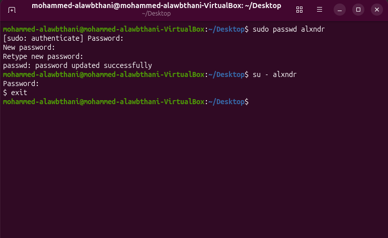

---

## 3. Checking Password Status

I checked the current password status of the user.

### Command

```bash
sudo passwd -S Alxndr
```

This command displays information about the password status and the last password change.

### Screenshot

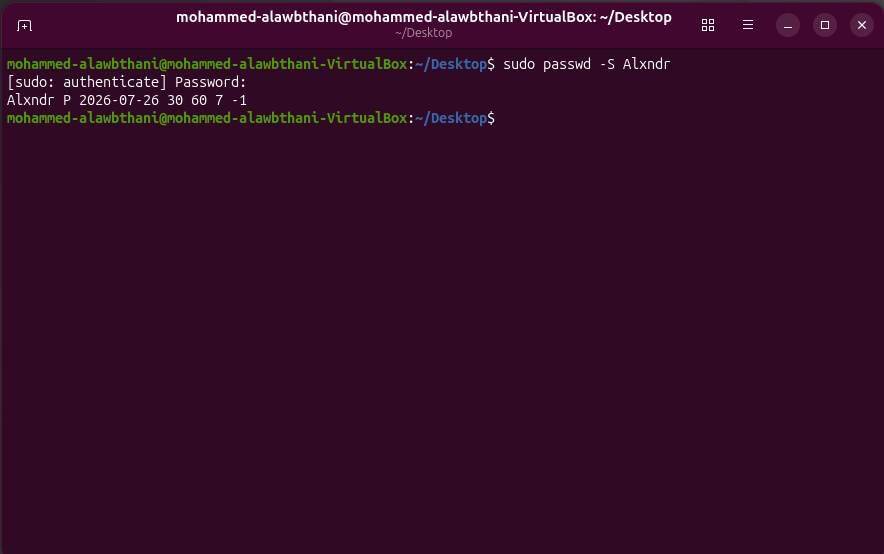

---

## 4. Locking the User Account

I locked the user account so password login would be disabled.

### Command

```bash
sudo usermod -L Alxndr
```

### Verification

```bash
sudo passwd -S Alxndr
```

### Screenshot

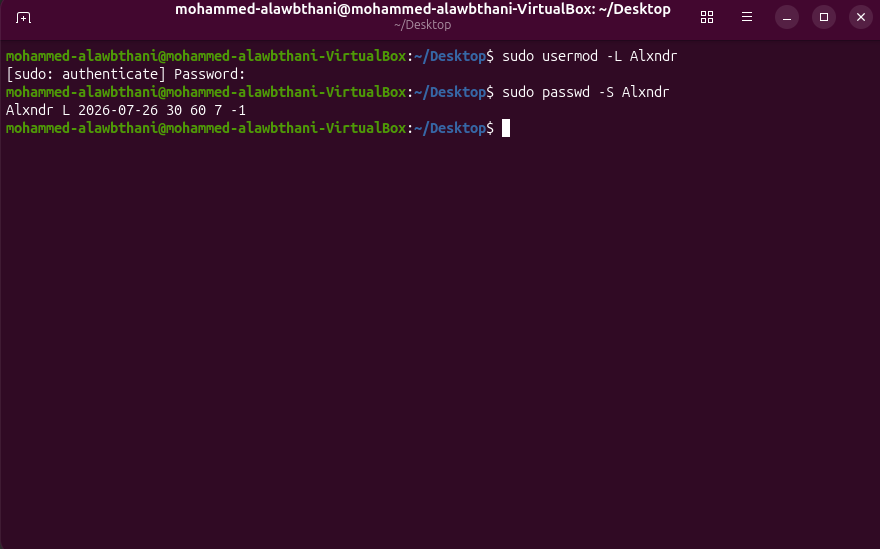

---

## 5. Unlocking the User Account

I unlocked the user account again.

### Command

```bash
sudo usermod -U Alxndr
```

### Verification

```bash
sudo passwd -S Alxndr
```

### Screenshot

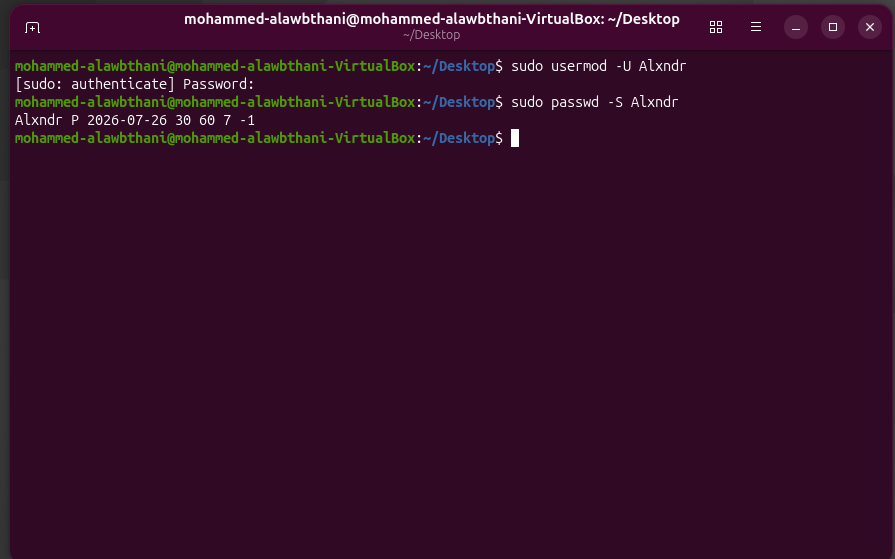

---

## 6. Modifying User Information

I modified the comment field of the user account.

### Command

```bash
sudo usermod -c "Alxndr alee" Alxndr
```

### Verification

```bash
grep '^Alxndr:' /etc/passwd
```

### Screenshot

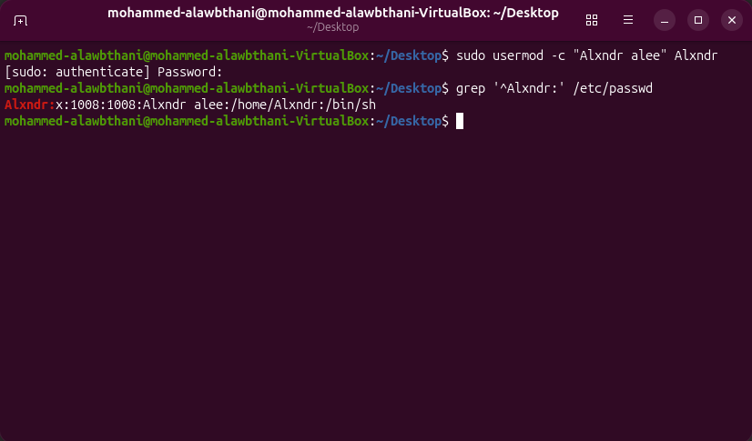

---

## 7. Viewing the User Entry in `/etc/passwd`

I checked the user's account entry inside `/etc/passwd`.

### Command

```bash
grep '^Alxndr:' /etc/passwd
```

The output contains information such as:

- Username
- UID
- GID
- User description
- Home directory
- Login shell

### Screenshot

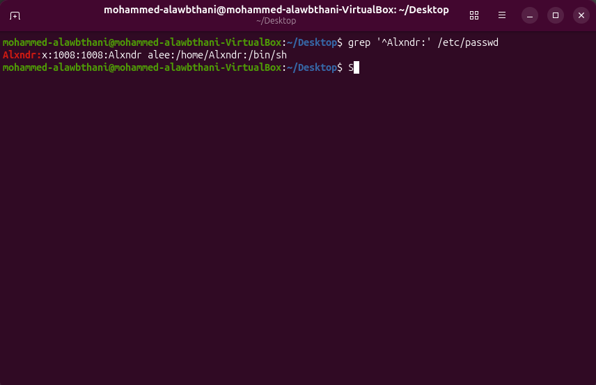

---

## 8. Viewing User ID Information

I checked the user's UID, GID, and group information.

### Command

```bash
id Alxndr
```

### Screenshot

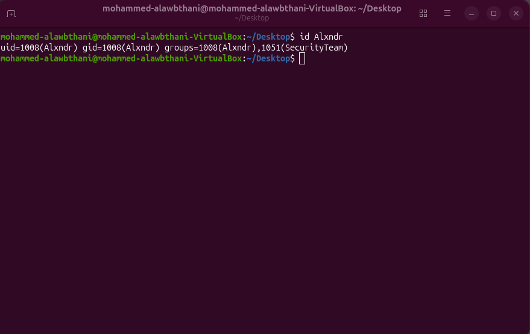

---

## 9. Changing the User Shell

I changed the user's login shell to Bash.

### Command

```bash
sudo usermod -s /bin/bash Alxndr
```

### Verification

```bash
getent passwd Alxndr
```

The last field of the output should show:

```text
/bin/bash
```

### Screenshot

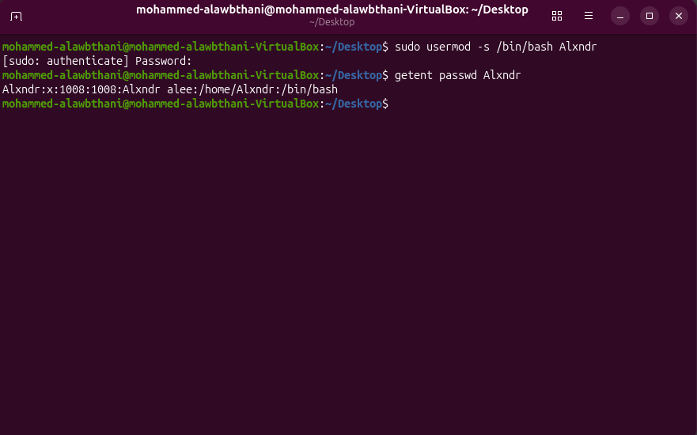

---

## 10. Configuring Password Aging

I configured password-aging settings for the user.

### Commands

```bash
sudo chage -E 2026-08-31 Alxndr
sudo chage -m 30 -M 60 Alxndr
```

The configuration includes:

- Account expiration date: `August 31, 2026`
- Minimum password age: `30 days`
- Maximum password age: `60 days`
- Password warning period: `7 days`

### Verification

```bash
sudo chage -l Alxndr
```

### Screenshot

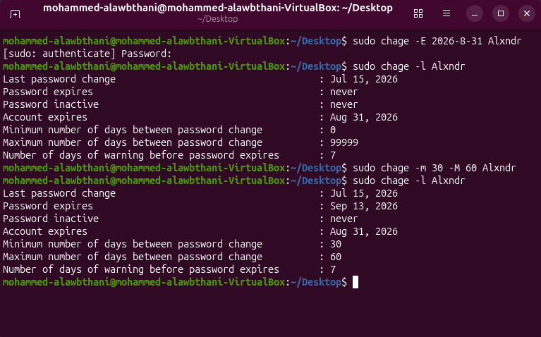

---

## 11. Deleting the User

I deleted the user and removed the user's home directory.

### Command

```bash
sudo userdel -r Alxndr
```

### Verification

```bash
id Alxndr
```

If the user was deleted successfully, Linux displays:

```text
id: ‘Alxndr’: no such user
```

### Screenshot

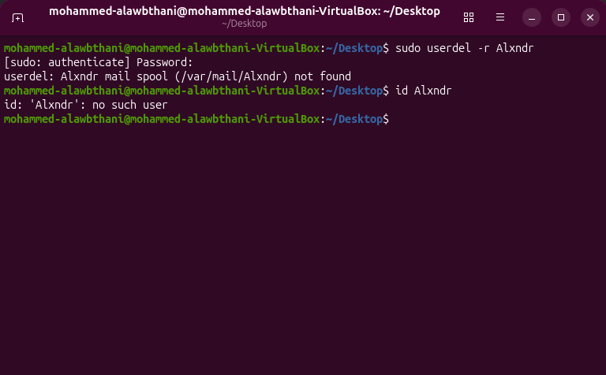

---

## Commands Practiced

```bash
sudo useradd -m Alxndr
id Alxndr

sudo passwd Alxndr
sudo passwd -S Alxndr

sudo usermod -L Alxndr
sudo passwd -S Alxndr

sudo usermod -U Alxndr
sudo passwd -S Alxndr

sudo usermod -c "Alxndr alee" Alxndr
grep '^Alxndr:' /etc/passwd

id Alxndr

sudo usermod -s /bin/bash Alxndr
getent passwd Alxndr

sudo chage -E 2026-08-31 Alxndr
sudo chage -m 30 -M 60 Alxndr
sudo chage -l Alxndr

sudo userdel -r Alxndr
id Alxndr
```

---

## What I Learned

- How to create a Linux user.
- How to create a home directory for a user.
- How to set a user password.
- How to check password status.
- How to lock a user account.
- How to unlock a user account.
- How to modify user account information.
- How to inspect a user's `/etc/passwd` entry.
- How to view UID and GID information.
- How to change a user's login shell.
- How to configure password-aging settings.
- How to set an account expiration date.
- How to delete a user and verify that the account no longer exists.
