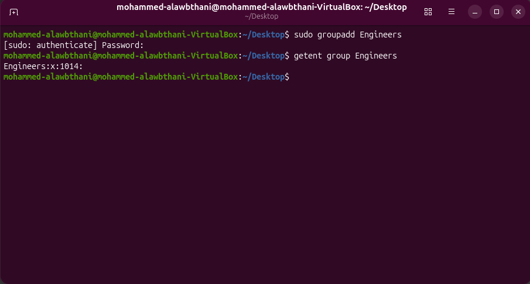
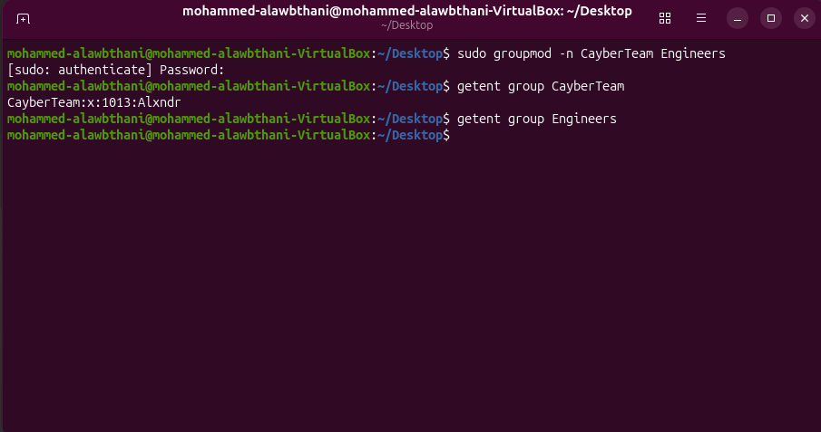
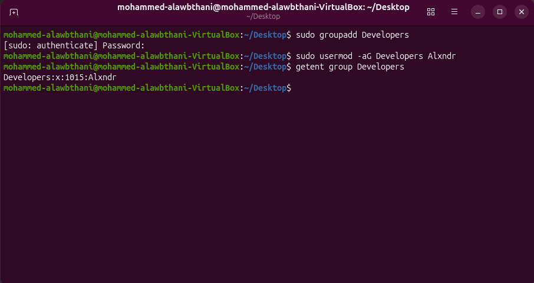
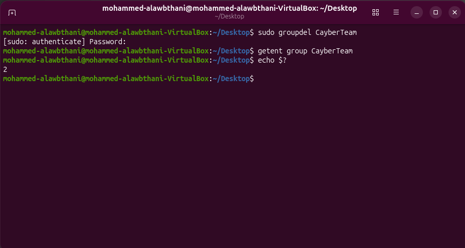

# Project 2B - Linux Group Management

In this project, I practiced creating, modifying, checking, and deleting Linux groups.

---

## 1. Creating a New Group

I created a new group named `Engineers`.

### Command

```bash
sudo groupadd Engineers
```

### Verification

I verified that the group was created successfully using:

```bash
getent group Engineers
```

The output showed:

```text
Engineers:x:1014:
```

This confirms that the `Engineers` group was created successfully.

### Screenshot



---

## 2. Renaming a Group

I changed the group name from `Engineers` to `CayberTeam`.

### Command

```bash
sudo groupmod -n CayberTeam Engineers
```

The `-n` option changes the group name.

### Verification

I checked the new group name using:

```bash
getent group CayberTeam
```

The output showed:

```text
CayberTeam:x:1013:Alxndr
```

I also checked the old group name:

```bash
getent group Engineers
```

No output appeared, which confirms that the old group name no longer exists.

### Screenshot



---

## 3. Adding a User to a Group

I created a new group named `Developers` and added the user `Alxndr` to it.

### Commands

```bash
sudo groupadd Developers
sudo usermod -aG Developers Alxndr
```

The `-aG` options add the user to a supplementary group without removing the user from other groups.

### Verification

I verified that the user was added successfully using:

```bash
getent group Developers
```

The output showed:

```text
Developers:x:1015:Alxndr
```

This confirms that `Alxndr` is a member of the `Developers` group.

### Screenshot



---

## 4. Deleting a Group

I deleted the group named `CayberTeam`.

### Command

```bash
sudo groupdel CayberTeam
```

### Verification

I checked whether the group still existed using:

```bash
getent group CayberTeam
```

No output appeared.

I then checked the exit status using:

```bash
echo $?
```

The result was:

```text
2
```

This confirms that the group was not found and had been deleted successfully.

### Screenshot



---

## Commands Practiced

```bash
sudo groupadd Engineers
getent group Engineers

sudo groupmod -n CayberTeam Engineers
getent group CayberTeam
getent group Engineers

sudo groupadd Developers
sudo usermod -aG Developers Alxndr
getent group Developers

sudo groupdel CayberTeam
getent group CayberTeam
echo $?
```

---

## What I Learned

- How to create a group using `groupadd`.
- How to verify a group using `getent group`.
- How to rename a group using `groupmod -n`.
- How to add a user to a supplementary group using `usermod -aG`.
- How to delete a group using `groupdel`.
- How to check the exit status of the previous command using `echo $?`.
