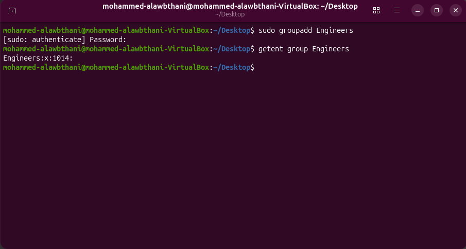
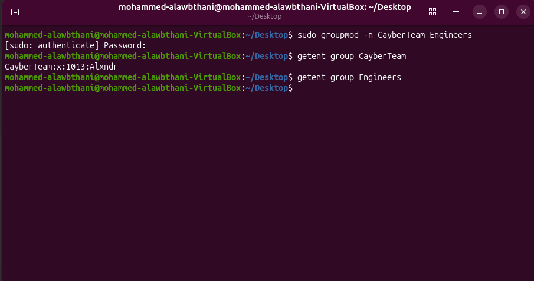
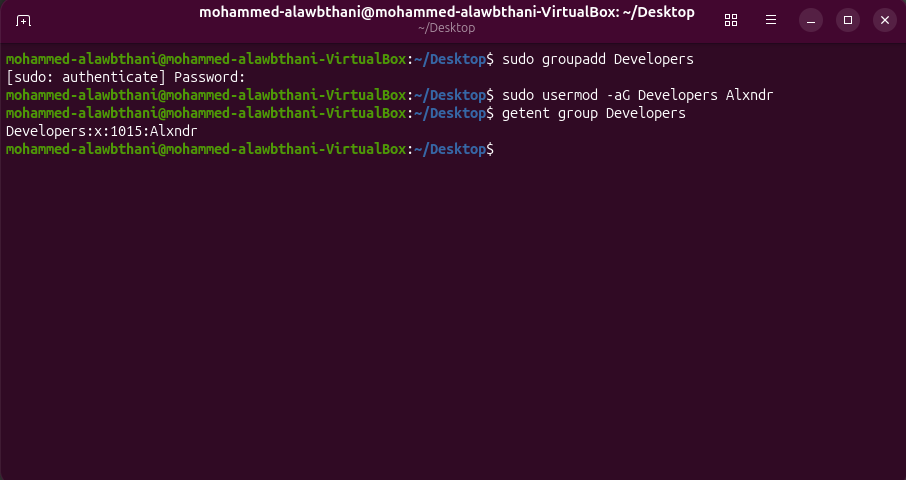
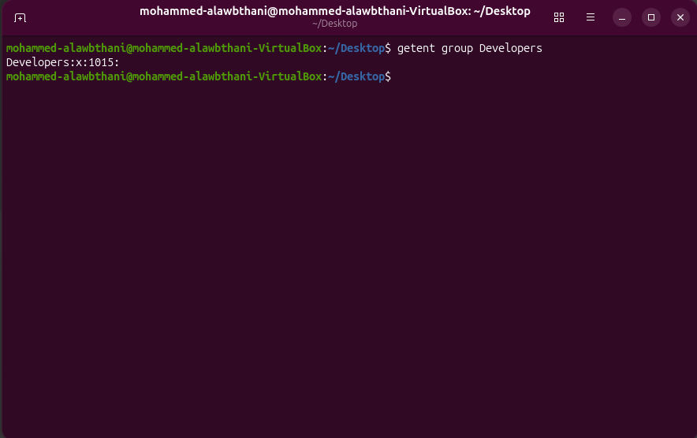
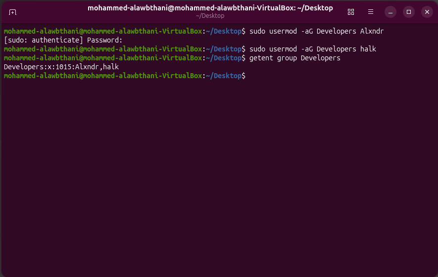
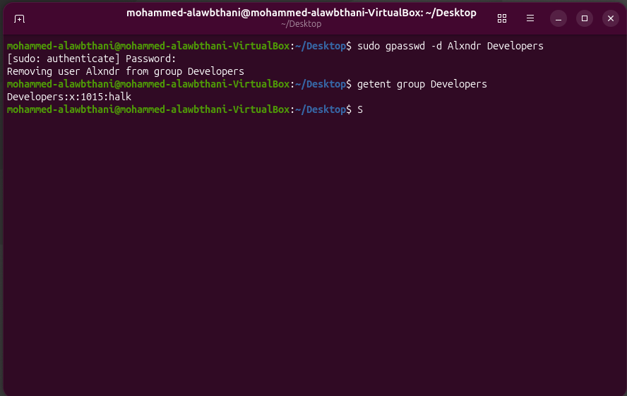
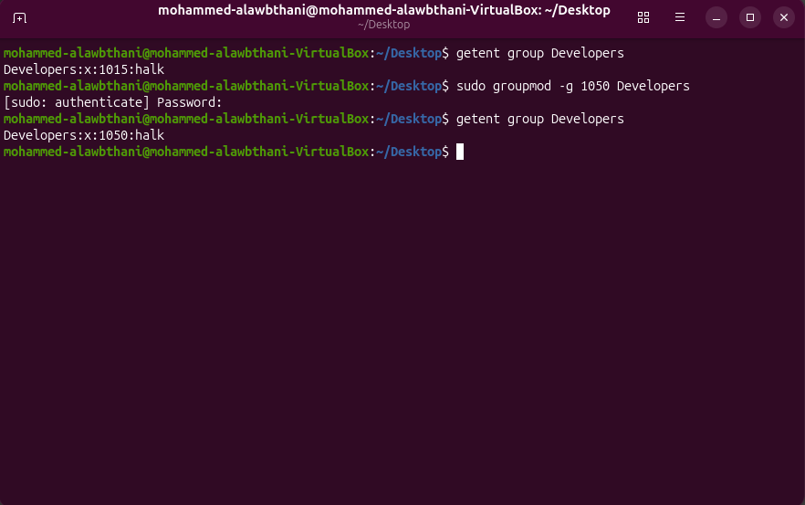
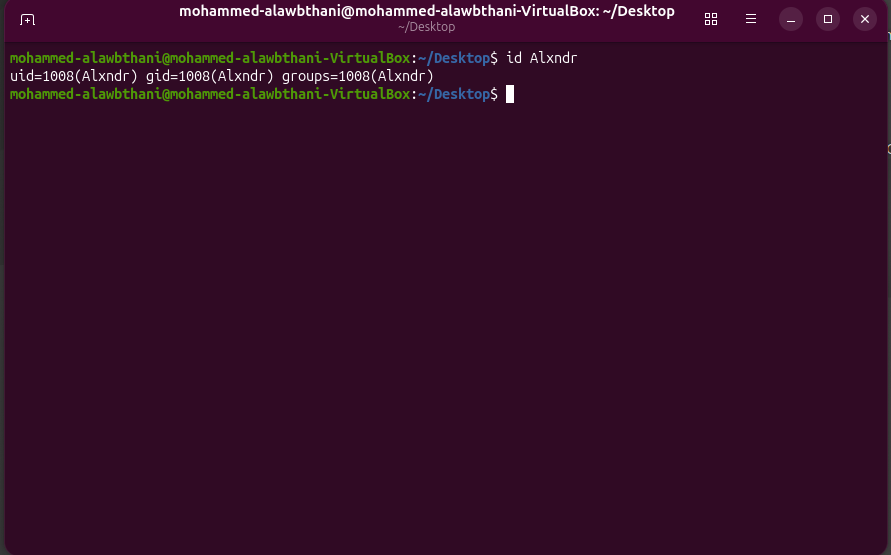
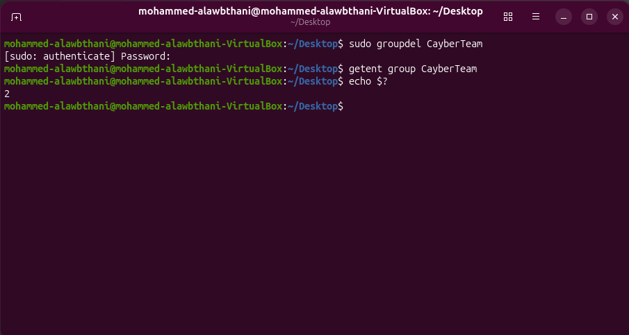

# Project 2B - Linux Group Management

In this project, I practiced creating, modifying, managing, verifying, and deleting Linux groups.

---

## 1. Creating a New Group

I created a new group named `Engineers`.

### Command

```bash
sudo groupadd Engineers
```

### Verification

```bash
getent group Engineers
```

### Screenshot



---

## 2. Renaming a Group

I renamed the group from `Engineers` to `CyberTeam`.

### Command

```bash
sudo groupmod -n CyberTeam Engineers
```

### Verification

```bash
getent group CyberTeam
```

I also checked that the old group name no longer existed:

```bash
getent group Engineers
```

### Screenshot



---

## 3. Adding a User to a Group

I added the user `Alxndr` to the `Developers` group.

### Commands

```bash
sudo groupadd Developers
sudo usermod -aG Developers Alxndr
```

### Verification

```bash
getent group Developers
```

### Screenshot



---

## 4. Viewing Group Members

I checked the members of the `Developers` group.

### Command

```bash
getent group Developers
```

This command displays the group name, GID, and group members.

### Screenshot



---

## 5. Adding Multiple Users to a Group

I added multiple users to the same group.

### Commands

```bash
sudo usermod -aG Developers user1
sudo usermod -aG Developers user2
```

### Verification

```bash
getent group Developers
```

### Screenshot



---

## 6. Removing a User from a Group

I removed the user `Alxndr` from the `Developers` group.

### Command

```bash
sudo gpasswd -d Alxndr Developers
```

### Verification

```bash
getent group Developers
```

### Screenshot



---

## 7. Changing the Group ID

I changed the GID of the `Developers` group.

### Command

```bash
sudo groupmod -g 1050 Developers
```

### Verification

```bash
getent group Developers
```

### Screenshot



---

## 8. Viewing All Groups for a User

I checked all groups that the user `Alxndr` belongs to.

### Command

```bash
groups Alxndr
```

I can also use:

```bash
id Alxndr
```

### Screenshot



---

## 9. Deleting a Group

I deleted the `CyberTeam` group.

### Command

```bash
sudo groupdel CyberTeam
```

### Verification

```bash
getent group CyberTeam
```

Then I checked the exit status:

```bash
echo $?
```

If the result is:

```text
2
```

the group was not found.

### Screenshot



---

## Commands Practiced

```bash
sudo groupadd Engineers
getent group Engineers

sudo groupmod -n CyberTeam Engineers
getent group CyberTeam
getent group Engineers

sudo groupadd Developers
sudo usermod -aG Developers Alxndr
getent group Developers

sudo usermod -aG Developers user1
sudo usermod -aG Developers user2

sudo gpasswd -d Alxndr Developers

sudo groupmod -g 1050 Developers

groups Alxndr
id Alxndr

sudo groupdel CyberTeam
getent group CyberTeam
echo $?
```

---

## What I Learned

- How to create groups using `groupadd`.
- How to rename groups using `groupmod`.
- How to add users to groups using `usermod -aG`.
- How to view group members using `getent group`.
- How to add multiple users to one group.
- How to remove a user from a group using `gpasswd -d`.
- How to change a group's GID.
- How to check all groups assigned to a user.
- How to delete groups using `groupdel`.
- How to verify command results using `echo $?`.
