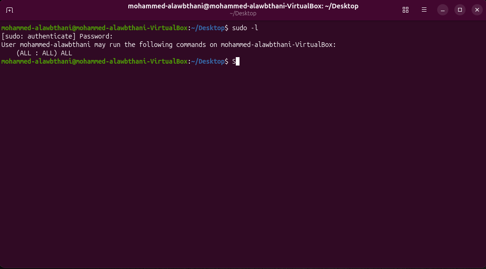
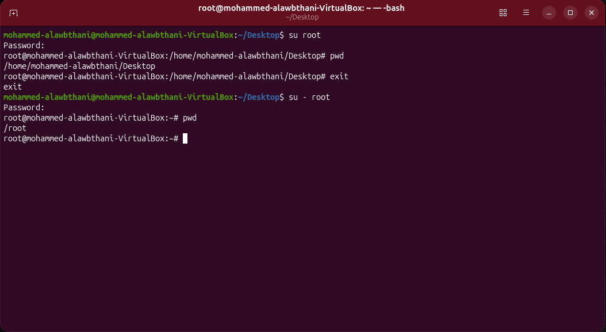
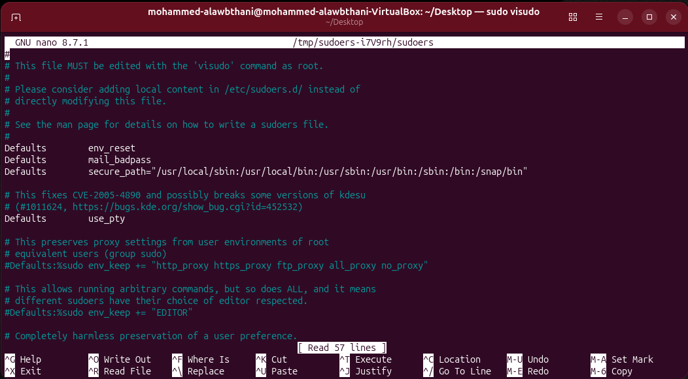
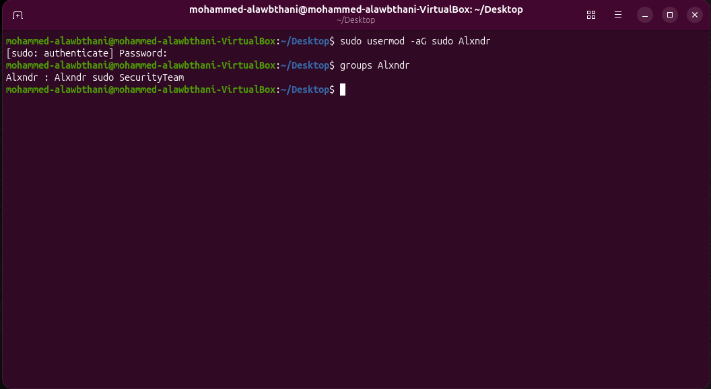
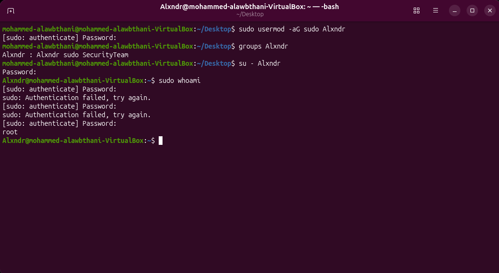
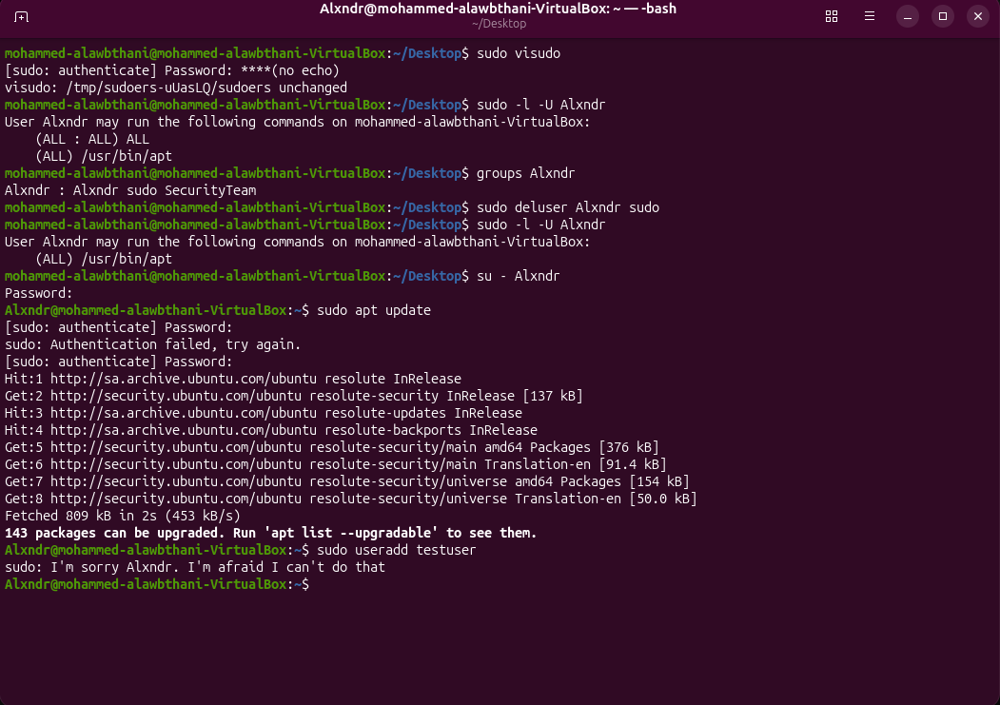
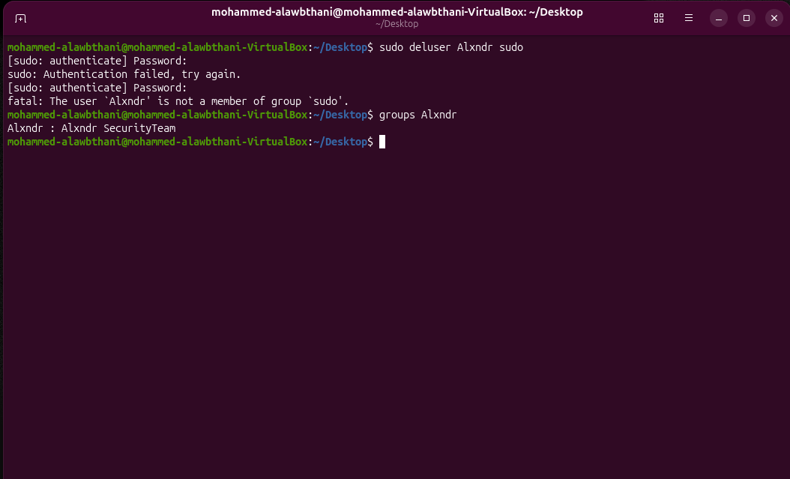

# Project 2C - Privilege Escalation and Sudo Management

In this project, I practiced Linux privilege escalation and administrative access using `sudo`, `su`, `visudo`, and `sudoedit`.

The goal of this project was to understand how Linux controls elevated privileges and how to apply the principle of least privilege.

---

## 1. Listing Sudo Permissions

I checked which commands the current user is allowed to run with `sudo`.

### Command

```bash
sudo -l
```

This command displays the sudo permissions assigned to the current user.

### Screenshot



---

## 2. Comparing `su` and `su -`

I practiced switching to the `root` account using two different methods.

### Commands

```bash
su root
```

and:

```bash
su - root
```

### Difference

`su root` switches to the root user while keeping much of the current user's environment.

`su - root` starts a full login shell for root and loads the root user's environment.

I also checked the current directory using:

```bash
pwd
```

### Screenshot



---

## 3. Safely Editing Sudoers with `visudo`

I opened the sudoers configuration using:

```bash
sudo visudo
```

`visudo` is the recommended way to edit sudo rules because it checks the file syntax before saving changes.

This helps prevent configuration errors that could break sudo access.

### Screenshot



---

## 4. Adding a User to the Sudo Group

I added the user `Alxndr` to the `sudo` group.

### Command

```bash
sudo usermod -aG sudo Alxndr
```

### Verification

```bash
groups Alxndr
```

This confirmed that the user was a member of the `sudo` group.

### Screenshot



---

## 5. Verifying Sudo Access

I switched to the user account and tested elevated privileges.

### Commands

```bash
su - Alxndr
sudo whoami
```

If sudo access is configured correctly, the result is:

```text
root
```

This confirms that the user can execute commands with root privileges through `sudo`.

### Screenshot



---

## 6. Creating a Limited Sudo Rule

Instead of giving the user full sudo permissions, I created a restricted sudo rule.

Inside `visudo`, I added:

```text
Alxndr ALL=(ALL) /usr/bin/apt
```

This rule allows `Alxndr` to use only:

```bash
sudo apt
```

with elevated privileges.

### Verification

```bash
sudo -l -U Alxndr
```

The allowed command was shown as:

```text
(ALL) /usr/bin/apt
```

### Screenshot


---

## 7. Testing Least Privilege

I removed the user from the full `sudo` group:

```bash
sudo deluser Alxndr sudo
```

Then I verified the remaining permissions:

```bash
sudo -l -U Alxndr
```

Only `/usr/bin/apt` remained available.

I switched to the user:

```bash
su - Alxndr
```

The allowed command worked:

```bash
sudo apt update
```

But an unauthorized command was denied:

```bash
sudo useradd testuser
```

This demonstrated the **Principle of Least Privilege**, where a user receives only the permissions required for a specific task.

### Screenshot



---

## 8. Editing a Protected File with `sudoedit`

I used `sudoedit` to safely open the protected `/etc/hosts` file.

### Command

```bash
sudoedit /etc/hosts
```

Using `sudoedit` is safer than launching an entire text editor directly with root privileges.

For example, instead of:

```bash
sudo nano /etc/hosts
```

I used:

```bash
sudoedit /etc/hosts
```

### Screenshot


---

## 9. Removing Full Sudo Access

I removed the user `Alxndr` from the `sudo` group.

### Command

```bash
sudo deluser Alxndr sudo
```

### Verification

```bash
groups Alxndr
```

The `sudo` group was no longer listed for the user.

I also checked the user's sudo permissions using:

```bash
sudo -l -U Alxndr
```

This allowed me to confirm that full sudo access had been removed.

### Screenshot



---

## Commands Practiced

```bash
sudo -l

su root
su - root
pwd

sudo visudo

sudo usermod -aG sudo Alxndr
groups Alxndr

su - Alxndr
sudo whoami

sudo -l -U Alxndr

sudo deluser Alxndr sudo

sudo apt update

sudo useradd testuser

sudoedit /etc/hosts
```

---

## What I Learned

* How to check sudo permissions using `sudo -l`.
* The difference between `su` and `su -`.
* How to safely edit sudo rules using `visudo`.
* How to add a user to the `sudo` group.
* How to verify elevated privileges with `sudo whoami`.
* How to create a restricted sudo rule.
* How to apply the principle of least privilege.
* How to allow one command while denying other privileged commands.
* How to safely edit protected files using `sudoedit`.
* How to remove full sudo access from a user.
* How Linux controls administrative privileges.

