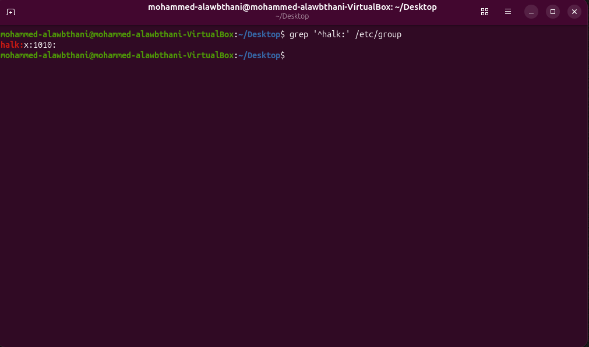
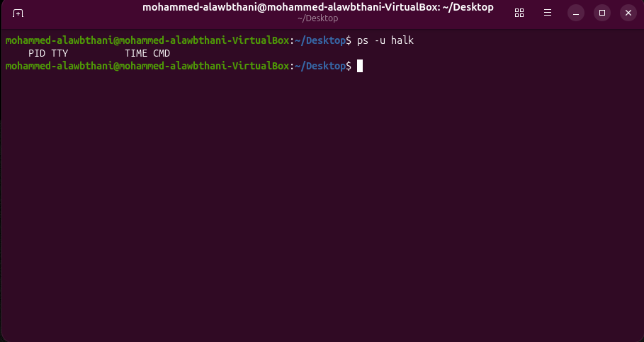
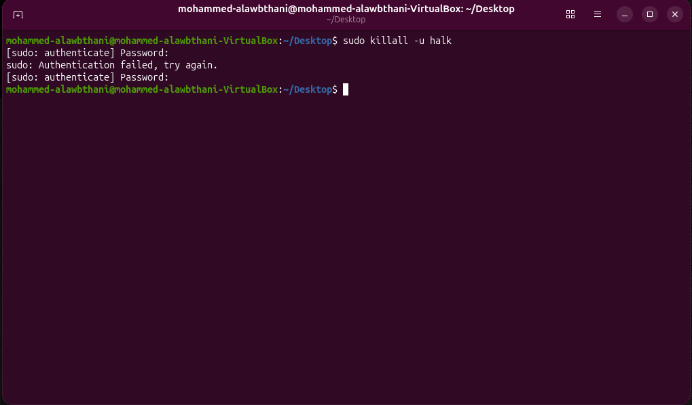
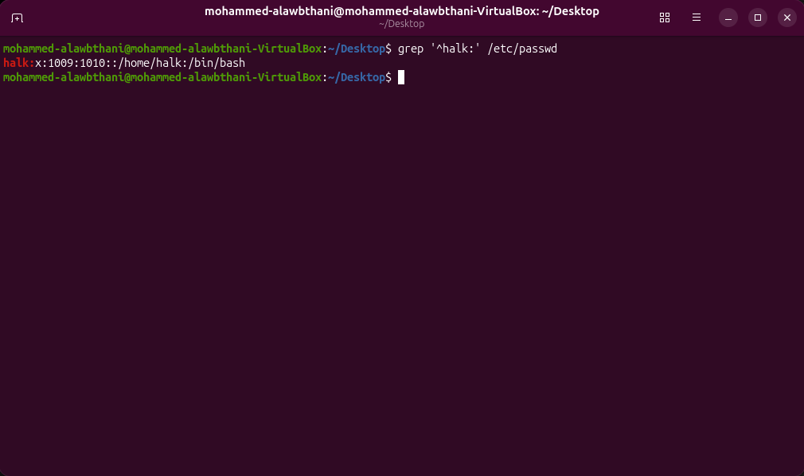
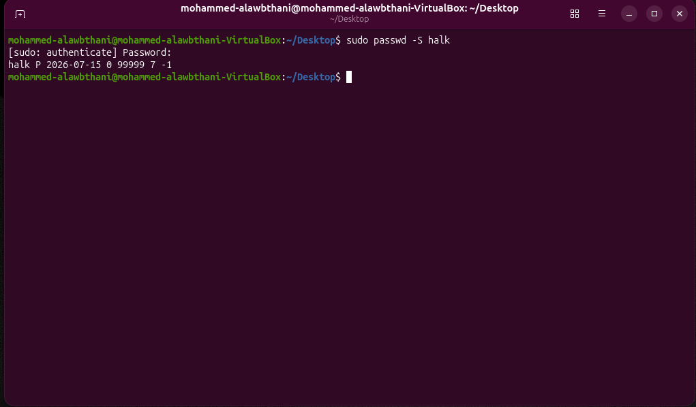
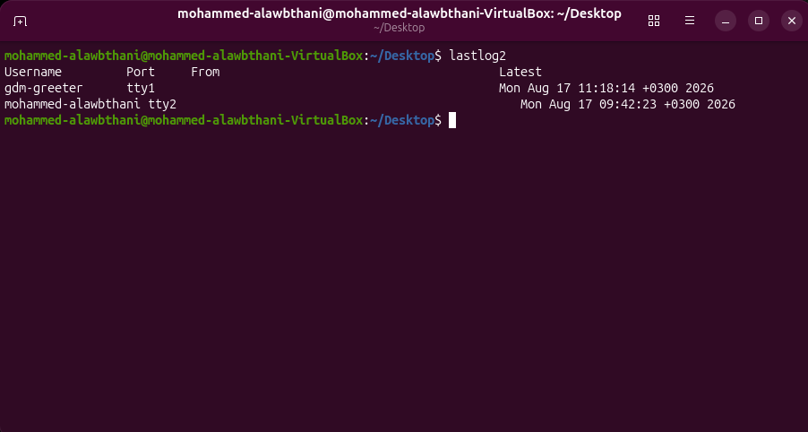
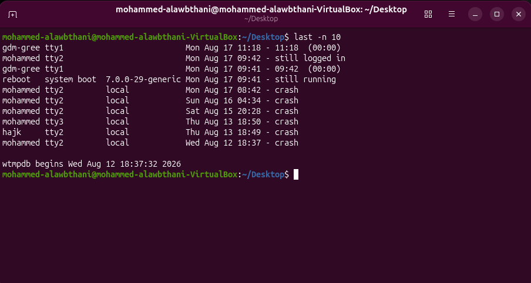
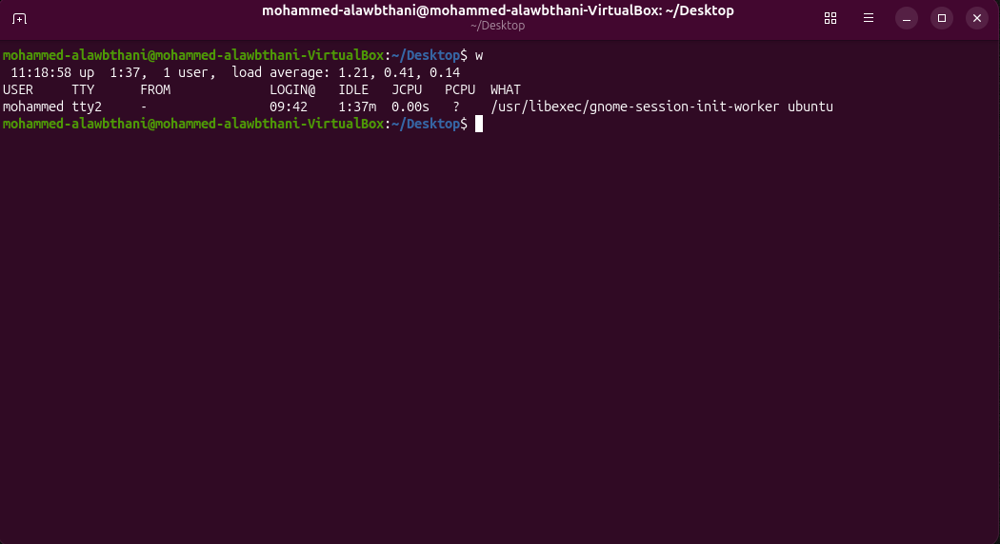

# Project 2D - Troubleshooting User and Group Issues

In this project, I practiced troubleshooting Linux user and group issues.

The goal of this project was to learn how to verify user accounts, check group membership, inspect running processes, review account status, and investigate login activity.

---

## 1. Verifying Group Membership

I checked whether a user belonged to the expected Linux group.

### Command

```bash
groups username
```

I also checked the group configuration file using:

```bash
grep groupname /etc/group
```

This helps identify permission problems caused by incorrect group membership.

### Screenshot



---

## 2. Checking User Processes

I checked which processes were running under a specific user account.

### Command

```bash
ps -u username
```

This command displays processes owned by the specified user.

This is useful before modifying or deleting a user account because active processes may prevent account management operations.

### Screenshot



---

## 3. Terminating User Processes

I practiced stopping all running processes owned by a specific user.

### Command

```bash
sudo killall -u username
```

The `-u` option specifies the user whose processes should be terminated.

This can be useful when active processes prevent a user account from being deleted.

### Screenshot



---

## 4. Verifying That a User Account Exists

I checked the `/etc/passwd` file to confirm that a user account existed on the system.

### Command

```bash
grep username /etc/passwd
```

If the account exists, Linux displays the corresponding user entry.

Example:

```text
username:x:1001:1001:User Name:/home/username:/bin/bash
```

This information includes the username, UID, GID, home directory, and login shell.

### Screenshot



---

## 5. Checking Account Status

I checked the password and account status of a user.

### Command

```bash
sudo passwd -S username
```

This command displays information about the user's password status.

It can help identify whether the password is configured, locked, or affected by account settings.

### Screenshot



---

## 6. Checking the Last Login

I used `lastlog2` to display the latest login information for user accounts.

### Command

```bash
lastlog2
```

This command displays information such as:

- Username
- Terminal
- Remote host
- Latest login date and time

This is useful for identifying accounts that have not been used recently.

### Screenshot



---

## 7. Reviewing Login History

I used the `last` command to review previous login and logout activity.

### Command

```bash
last
```

This command can display:

- User login sessions
- Logout times
- Session duration
- System reboots
- Boot events

This is useful for system audits and troubleshooting login activity.

### Screenshot



---

## 8. Checking Active Users

I used the `w` command to view users who currently had active sessions.

### Command

```bash
w
```

The output can include:

- Username
- Terminal
- Login time
- Idle time
- CPU usage
- Current command or process

This is useful for checking whether a user is logged in and whether the session is active or idle.

### Screenshot



---

## Commands Practiced

```bash
groups username
grep groupname /etc/group
ps -u username
sudo killall -u username
grep username /etc/passwd
sudo passwd -S username
sudo chage --list username
lastlog2
last
who
w
```

---

## Troubleshooting Process

When a user or group problem occurs, I learned to troubleshoot it in a logical order.

### User Account Problems

1. Verify that the user account exists.

```bash
grep username /etc/passwd
```

2. Check the user's account and password status.

```bash
sudo passwd -S username
```

3. Check password aging and expiration information if necessary.

```bash
sudo chage --list username
```

4. Check whether the user has active processes.

```bash
ps -u username
```

5. Terminate the processes if required.

```bash
sudo killall -u username
```

---

### Login Problems

If a user cannot log in, I check:

- Whether the account exists
- Whether a valid password is configured
- Whether the password has expired
- Whether the account is locked
- Whether the account has expired
- Whether the login shell is valid

Useful commands include:

```bash
grep username /etc/passwd
sudo passwd -S username
sudo chage --list username
```

---

### Login Activity

I used several commands to investigate login activity.

```bash
lastlog2
```

Displays the latest login information for users.

```bash
last
```

Displays previous login and logout sessions.

```bash
who
```

Displays users who currently have login sessions.

```bash
w
```

Displays active users with additional session information.

---

## What I Learned

* How to verify that a Linux user account exists.
* How to check Linux group membership.
* How to inspect processes owned by a specific user.
* How to terminate user processes when necessary.
* How to check password and account status.
* How to investigate user login problems.
* How to use `lastlog2` to check the latest login information.
* How to use `last` to review login and logout history.
* How to use `who` and `w` to identify active user sessions.
* How to troubleshoot user and group problems in a logical order.
* How Linux stores user information in `/etc/passwd`.
* How Linux stores group information in `/etc/group`.
* How account status, active processes, and login history can help identify system problems.

---

## Key Troubleshooting Commands

```bash
grep username /etc/passwd
grep groupname /etc/group
groups username
ps -u username
sudo killall -u username
sudo passwd -S username
sudo chage --list username
lastlog2
last
who
w
```

---

## Conclusion

This project helped me understand how Linux administrators troubleshoot user and group problems.

Instead of immediately changing or deleting accounts, I learned to first identify the cause of the problem by checking account information, group membership, running processes, password status, and login history.

These troubleshooting commands provide useful information for diagnosing common Linux user and group issues.
